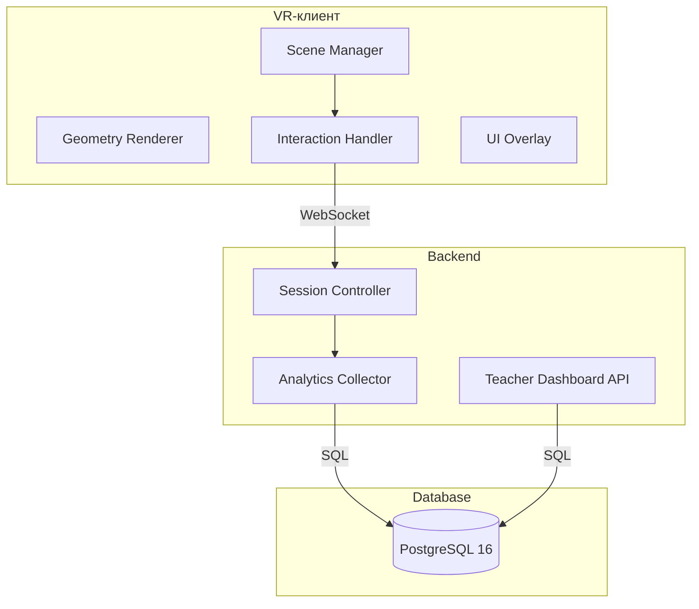

# Шаблоны для ВКР-проектов

Готовые структуры для аналитической и проектной глав IT-ВКР. Заполняются содержательно и включаются в текст работы или в приложения.

Все шаблоны представлены в формате **Markdown-таблиц**, которые при переносе в Word становятся аккуратными таблицами с границами. Используй их в главах 2 (Аналитическая) и 3 (Проектная).

---

## 1. Таблица сравнения конкурентов

Размещение: **Глава II (аналитическая часть)**, параграф «Анализ конкурентов и альтернативных решений».

Схема: 4-6 конкурентов × 5-7 критериев.

**Пример для VR-образовательного приложения:**

| Критерий | Наш продукт | Immersive VR Education | zSpace | Nearpod VR | Google Expeditions |
|----------|-------------|------------------------|--------|------------|---------------------|
| Предметная область | Стереометрия 7-9 кл. | Анатомия, история | Все школьные | Все школьные | Все школьные |
| Платформа гарнитуры | Meta Quest 2/3 | Quest, Vive | Собственный AR | Cardboard | Cardboard |
| Русский язык | Да | Нет | Нет | Ограниченно | Прекращён |
| Интеграция с ФГОС | Да | Нет | Нет | Нет | Нет |
| Цена на 1 учащегося | Бесплатно | ~$30/мес | ~$3500 комплект | $14.99/мес | Бесплатно |
| Измеряет прогресс | Да | Да | Нет | Да | Нет |
| Offline-режим | Да | Частично | Да | Нет | Нет |

**После таблицы — вывод на 3-5 предложений:**

> Проведённый анализ показывает, что существующие решения либо не адаптированы для русскоязычной аудитории и российских образовательных программ, либо имеют значительный ценовой барьер для массового школьного внедрения. Наиболее близкий по функциональности продукт — zSpace — требует специализированного оборудования стоимостью от 3500 долларов, что делает его неприменимым в типовой российской школе. Таким образом, ниша образовательных VR-приложений для российских школ, совместимых с доступными гарнитурами и бесплатных для конечного пользователя, остаётся фактически открытой. Настоящий проект позиционируется именно в этой нише.

---

## 2. Аналитический формат — выбор из четырёх вариантов

Размещение: **Глава II или Глава III**, в зависимости от акцента.

⚠️ **При friend-sharing (v6.26-friends):** разные пользователи скилла должны выбирать **разные** форматы из четырёх ниже, чтобы структурный отпечаток работ не совпадал. Поле в state-файле: `structural_choices.ch2_competitor_format` ∈ {`swot`, `tows`, `pestel`, `matrix-6col`}. Выбор делается через `user_seed`:

```python
import random
random.seed("ваш_user_seed")
print(random.choice(["swot", "tows", "pestel", "matrix-6col"]))
```

### Вариант A — SWOT (классическая 2×2)

| | **Положительные факторы** | **Отрицательные факторы** |
|--|----------------------------|---------------------------|
| **Внутренние** | **Сильные стороны (Strengths):** <br>— Русская локализация <br>— Бесплатность для школ <br>— Интеграция с ФГОС <br>— Работает на массовых гарнитурах | **Слабые стороны (Weaknesses):** <br>— Ограниченная предметная область <br>— Зависимость от наличия VR-оборудования <br>— Небольшая команда разработки |
| **Внешние** | **Возможности (Opportunities):** <br>— Рост госпрограмм цифровизации <br>— Удешевление VR-гарнитур <br>— Интерес учителей к новым методикам | **Угрозы (Threats):** <br>— Появление крупного конкурента <br>— Изменение ФГОС <br>— Критика VR в школе со стороны родителей |

**После таблицы:** 3-4 предложения о стратегии реагирования + 2-3 о использовании возможностей.

### Вариант B — TOWS (матрица стратегий 2×2 + перекрёстный анализ)

TOWS — продвинутый вариант SWOT, где после идентификации факторов идёт **перекрёстный анализ стратегий**.

**Шаг 1.** Те же 4 категории (S/W/O/T), что и в SWOT.

**Шаг 2.** Матрица стратегий 2×2:

| | **Strengths** | **Weaknesses** |
|--|---------------|----------------|
| **Opportunities** | **SO-стратегия (агрессивная):** <br>Используем сильные стороны для захвата возможностей. <br>*Пример:* русская локализация + рост госпрограмм → активное продвижение в региональные образовательные департаменты | **WO-стратегия (компенсация):** <br>Преодолеваем слабости через возможности. <br>*Пример:* малая команда → партнёрство с педагогическими вузами для расширения предметных областей |
| **Threats** | **ST-стратегия (защита):** <br>Используем сильные стороны против угроз. <br>*Пример:* интеграция с ФГОС → защита от конкурентов через раннее закрепление методики в школах | **WT-стратегия (минимизация):** <br>Минимизируем слабости и угрозы. <br>*Пример:* зависимость от VR-оборудования + критика родителей → разработать дополнительный 2D-режим для классов без VR |

**После таблицы:** 4-5 предложений о выбранной стратегии (обычно — комбинация SO+ST для нового продукта на растущем рынке).

### Вариант C — PESTEL (макроанализ среды 2×3)

PESTEL разбирает **внешнюю** среду по 6 факторам — подходит когда продукт сильно зависит от регуляторики/технологий/экономики.

| | **Возможности** | **Риски** |
|--|------------------|-----------|
| **P (Political)** — политические | Госпрограммы цифровизации образования (нацпроект «Образование» 2025-2030); поддержка отечественного ПО | Возможные ограничения на иностранные платформы (Meta Quest); требование импортозамещения |
| **E (Economic)** — экономические | Рост бюджетов школ на цифровое оборудование; снижение цен на VR-гарнитуры | Бюджетные ограничения сельских школ; колебания валюты для импортного оборудования |
| **S (Social)** — социальные | Интерес поколения Z к цифровым форматам; рост принятия VR родителями молодого поколения | Опасения старших учителей; критика «цифровой зависимости» |
| **T (Technological)** — технологические | Развитие отечественного ПО для VR; рост производительности гарнитур; стандартизация WebXR | Быстрое устаревание оборудования; фрагментация платформ |
| **E (Environmental)** — экологические | Снижение использования бумажных учебников | Электронные отходы при массовом внедрении |
| **L (Legal)** — правовые | 152-ФЗ о персональных данных учащихся уточнён в 2024 — есть прозрачные требования | Требования возрастных ограничений к VR (СанПиН для школ) |

**После таблицы:** 3-4 предложения о приоритетных факторах (обычно T + L для IT-продукта в образовании).

### Вариант D — Матрица сравнения 6 столбцов (расширенный конкурентный анализ)

Это уже не SWOT, а **детальная функциональная матрица**. Ничего не сравнивается «положительно/отрицательно» — фиксируется только наличие или объём функций.

| Функция / характеристика | Наш продукт | Конкурент 1 | Конкурент 2 | Конкурент 3 | Конкурент 4 | Конкурент 5 |
|---------------------------|-------------|-------------|-------------|-------------|-------------|-------------|
| Поддержка русского языка | ✅ Полная | ❌ Нет | ⚠️ Частичная | ❌ Нет | ✅ Полная | ❌ Нет |
| Интеграция с ФГОС | ✅ Да | ❌ Нет | ❌ Нет | ❌ Нет | ⚠️ Анонс | ❌ Нет |
| Цена на одного учащегося | Бесплатно | $30/мес | $3500 (CAPEX) | $14.99/мес | Бесплатно | Прекращён |
| Платформа | Meta Quest 2/3 | Quest, Vive | Собственный AR | Cardboard | WebXR | — |
| Offline-режим | ✅ Да | ⚠️ Частично | ✅ Да | ❌ Нет | ❌ Нет | — |
| Измерение прогресса | ✅ Встроенно | ✅ Внешне | ❌ Нет | ✅ Да | ⚠️ Базово | — |
| Локализация интерфейса | RU | EN | EN | EN, ES | RU, EN | EN |

**После таблицы:** 5-7 предложений анализа — где наш продукт **превосходит**, где **сопоставим**, где **уступает**, и почему ниша остаётся открытой.

---

---

## 3. Карточка целевой аудитории (персона)

Размещение: **Глава II**, параграф «Изучение целевой аудитории».

Для проекта обычно 2-3 персоны (не одна, не пять):

**Персона №1: Учитель математики**

| Поле | Значение |
|------|----------|
| Имя (вымышленное) | Елена Сергеевна |
| Возраст | 42 года |
| Стаж работы | 18 лет |
| Место работы | ГБОУ Школа № N, Москва |
| Квалификация | Высшая категория, учитель математики |
| Техническая грамотность | Средняя. Уверенно работает с Word, Excel, ЭЖД. VR ранее не использовала. |
| Основные задачи | Провести урок стереометрии за 40 минут, объяснить объёмные фигуры, оценить понимание |
| Боли и проблемы | Учащиеся плохо визуализируют трёхмерные объекты. Учебник плоский, чертежи на доске не всегда понятны. Модели из набора хрупкие и не у всех. |
| Мотивация использовать VR | Если это повышает вовлечённость и не требует сложного обучения — готова попробовать |
| Барьеры | Боится технических сбоев, не хочет тратить время урока на настройку |
| Ключевые требования | Быстрая настройка (<5 мин), автономная работа без интернета, понятная панель управления |

**Персона №2: Ученик 8-го класса**

| Поле | Значение |
|------|----------|
| Имя | Артём |
| Возраст | 14 лет |
| Интересы | Игры, спорт, YouTube, Discord |
| Отношение к математике | Прохладное; «не понимает, зачем это» |
| Опыт с VR | Играл в VR у друга 2-3 раза; знает, что такое Quest |
| ... | ... |

---

## 4. Матрица требований (MoSCoW)

Размещение: **Глава III**, параграф «Проектирование».

Требования делятся на 4 категории:

**Must have** (без этого проект не работает):
- Запуск на Meta Quest 2 и выше
- Отрисовка 5 базовых стереометрических фигур (куб, параллелепипед, цилиндр, конус, шар)
- Возможность рассмотреть фигуру со всех сторон движением головы
- Интерактивный сетчатый чертёж рядом с 3D-моделью
- Время сессии настраивается учителем (10/15/20 мин)

**Should have** (сильно желательно):
- 10+ фигур, включая композитные (комбинации призм и пирамид)
- Задания на соответствие между 3D и 2D-представлениями
- Автоматическая оценка ответа с feedback
- Запись истории ответов ученика для учителя

**Could have** (если останется время):
- Мультиплеер: несколько учеников в одной VR-комнате
- Авторский редактор фигур для учителя
- Экспорт задач в PDF для классической работы
- Поддержка дополнительных гарнитур (Pico, Vive Focus)

**Won't have** (явно не делаем в этой итерации):
- Интеграция с электронным журналом (ЭЖД)
- Поддержка языков кроме русского
- Мобильная версия (без VR)
- Облачная синхронизация между устройствами

---

## 5. User Journey Map

Размещение: **Глава III**, параграф «Дизайн пилотного запуска» или «Содержание проекта».

Простой вариант — таблица шагов:

| Этап | Действие пользователя | Эмоция | Боль / Risk | Возможность |
|------|----------------------|--------|-------------|-------------|
| 1. Знакомство | Учитель надевает гарнитуру на ученика, запускает сессию | Интерес + нервозность | Дискомфорт от гарнитуры; страх «уронить» | Тёплый брифинг 2-3 мин до запуска |
| 2. Первое погружение | Ученик видит 3D-сцену с фигурой | Удивление | VR-sickness при резких движениях | Мягкое вступление с статичной сценой |
| 3. Взаимодействие | Ученик обходит фигуру, рассматривает сечения | Увлечение | Если управление сложное — фрустрация | Минималистичное UI, подсказки только при запросе |
| 4. Задание | Вопрос на экране: «Какое сечение получится при...?» | Напряжение | Сложная механика ответа | Ответ жестом руки — указать на правильный вариант |
| 5. Feedback | Ответ правильный / неправильный | Радость / разочарование | Резкий фидбэк демотивирует | Мягкий фидбэк с объяснением почему |
| 6. Завершение | Снимает гарнитуру, возвращается в класс | Усталость + эйфория | Дискомфорт глаз после длинной сессии | Строгое ограничение на длительность сессии (15 мин) |

---

## 6. Архитектурная диаграмма (текстовая)

Размещение: **Глава III**, параграф «Архитектура решения».

Если нет возможности нарисовать (или для черновика) — текстовое описание уровней:

```
┌─────────────────────────────────────────┐
│  VR-клиент (Unity 6.0.28f1 + OpenXR)    │
│  ├── Scene Manager                      │
│  ├── Geometry Renderer                  │
│  ├── Interaction Handler                │
│  └── UI Overlay (TextMeshPro)           │
└─────────────────┬───────────────────────┘
                  │ WebSocket (Socket.IO)
                  │
┌─────────────────▼───────────────────────┐
│  Backend (Node.js 22 LTS + Express)     │
│  ├── Session Controller                 │
│  ├── Analytics Collector                │
│  ├── Teacher Dashboard API              │
│  └── Auth Service (JWT)                 │
└─────────────────┬───────────────────────┘
                  │ PostgreSQL
                  │
┌─────────────────▼───────────────────────┐
│  Data Layer (PostgreSQL 16)             │
│  ├── sessions (student_id, duration)    │
│  ├── answers (session_id, question,     │
│  │            correct, timestamp)       │
│  └── metrics_cache                      │
└─────────────────────────────────────────┘
```

**Лучше** — нарисовать в draw.io, PlantUML, Mermaid или C4. Но текстовая схема годится для черновика.

В `drafts/*.md` сборка не рисует диаграммы: fenced-блок (в том числе `mermaid`) печатается как листинг кода. Для рисунка экспортируй схему в PNG, положи в `evidence/figures/` и вставь `` (`drafts-format.md` → «Рисунки»).

### Mermaid-вариант архитектуры (исходник схемы для экспорта в PNG):



---

## 7. Таблица метрик пилотирования

Размещение: **Глава III**, параграф «Анализ результатов тестового внедрения».

Шаблон для фиксации (числа в строках ниже — пример формы, а не данные; в работу попадают только результаты реального пилота из `evidence/pilot/`, пока данных нет — таблица не включается):

| Метрика | Инструмент | Пред-значение | Пост-значение | Изменение | Значимость |
|---------|-----------|---------------|---------------|-----------|------------|
| Успешность в задачах на вращение тел | Пред-/пост-тест на 20 задач | 42% (8.4/20) | 61% (12.2/20) | +19% | p<0.05, n=18 |
| Субъективная оценка сложности темы | 5-балльная шкала | 3.8 | 2.9 | -0.9 | n/a (small sample) |
| Вовлечённость по SUS | Опросник System Usability Scale | — | 78/100 | — | Выше бенчмарка 68 |
| Время на задачу (среднее) | Логи системы | 3:42 мин | 2:18 мин | -38% | — |
| Самооценка понимания («Стало понятнее»?) | Опрос | — | 83% «да» или «скорее да» | — | — |

### Про метрики для образовательных продуктов

- **SUS (System Usability Scale)** — 10 вопросов, шкала 0-100. Бенчмарк: 68 — средний, >80 — хороший UX
- **NPS (Net Promoter Score)** — «Рекомендовали бы другу?» от -100 до +100
- **Пред-/пост-тест** — одинаковые задания до и после использования продукта
- **Time on task** — среднее время выполнения задачи
- **Task completion rate** — % успешно завершённых сессий

Для малой выборки (N<30) — не заявлять статистическую значимость без правильного теста (t-критерий, U-Манна-Уитни). Лучше писать: «на выборке в N человек наблюдается тенденция к повышению показателя».

---

## 8. Выводы по главе — шаблон

Если утверждённый план или научный руководитель предусматривают выводы по главам, в конце главы — блок «Выводы по главе N» из 3-5 пунктов. В черновике это заголовок `## Выводы по главе`; номер главы римскими цифрами ставит сборка.

**Шаблон для Главы I (теоретическая):**

```
Выводы по главе I

1. Рассмотрены теоретические основы применения VR-технологий в школьном
   образовании. Установлено, что ключевой педагогической базой данного
   подхода выступают деятельностная теория Л.С. Выготского и теория
   когнитивной нагрузки Дж. Свеллера.

2. Выделены три основных подхода к проектированию образовательного VR-
   контента: симуляционный, исследовательский и тренажёрный. Выбор
   подхода определяется дидактической задачей.

3. Определены психолого-педагогические особенности подросткового возраста,
   релевантные для VR-обучения: интенсивное формирование пространственного
   мышления, высокая чувствительность к сенсорной новизне, необходимость
   внешней структуры учебной деятельности.

4. Проанализированы риски VR-обучения, основным из которых является
   VR-sickness, затрагивающее по разным оценкам от 25 до 40% пользователей.
   Выявлены технические и методические способы минимизации этого эффекта.
```

**Правила:**
- Без ссылок на источники (это вывод, а не теоретический абзац)
- Каждый пункт — 2-3 предложения
- Пронумеровано арабскими цифрами
- Стиль — констатирующий («рассмотрены», «выделены», «определены», «проанализированы»)

---

## 9. Структура Game Design Document (GDD) — если работа про игру

Размещение: **В приложениях**, полный текст; в **Главе III** — краткая выдержка.

### Полный GDD

1. **Концепция** (1 стр.)
   - Жанр
   - Платформа
   - Целевая аудитория
   - Высокоуровневое описание в 3-5 предложениях
2. **Основной геймплей** (2-3 стр.)
   - Core loop
   - Механики
   - Прогрессия
3. **Сюжет и сеттинг** (1-2 стр., если применимо)
4. **Персонажи** (1 стр. на каждого ключевого)
5. **Уровни / режимы** (2-3 стр.)
6. **Интерфейс и UX** (1 стр.)
7. **Арт-стиль** (1 стр. + референсы)
8. **Звук и музыка** (0.5 стр.)
9. **Технические требования** (1 стр.)
   - Движок, версия
   - Целевые характеристики устройств
   - Fallback для слабых устройств
10. **Монетизация** (если применимо; для обр. игр — часто N/A)

---

## 10. Формат ссылок на продукт в тексте работы

Если у продукта есть **публичный или приватный репозиторий** — указывать в тексте и в списке литературы:

В тексте (первое упоминание):
> Исходный код проекта размещён в репозитории на платформе Gitea (см. Приложение 1) и содержит около 3400 строк на языке C# (оценка на момент сдачи работы).

В списке литературы:
> NN. Скориков, Н.Н. VR-тренажёр по стереометрии: исходный код проекта [Электронный ресурс] / Н.Н. Скориков. – 2026. – URL: https://git.example.com/skorikov/vkr-vr-stereometry (дата обращения: ДД.ММ.ГГГГ).

В приложении:
> **Приложение 1. Структура репозитория проекта**
> [Скриншот дерева папок + описание модулей]
